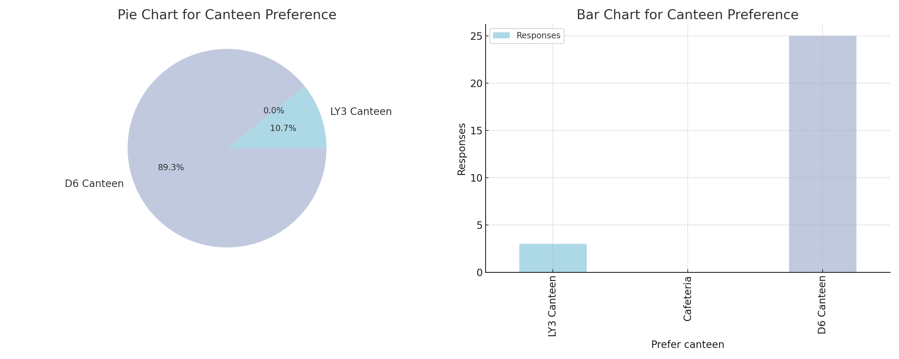
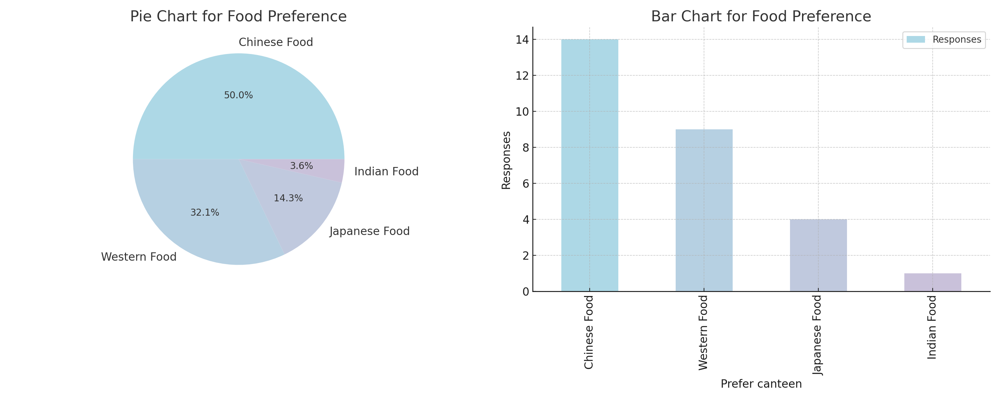

<html lang="en">
<head>
    <meta charset="UTF-8">
    <meta http-equiv="X-UA-Compatible" content="IE=edge">
    <meta name="viewport" content="width=device-width, initial-scale=1.0">
    <title>XMUM Students Favourite Food</title>
    
</head>
<body>
    <h1>XMUM Students Favourite Food</h1>
    

        
        

            
            
            
        

        
    

</body>
</html>

